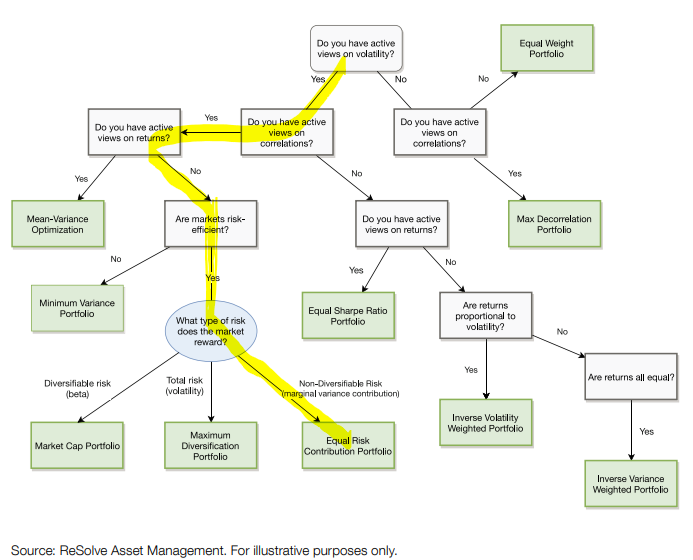

This is a multi-asset portfolio optimisation process, where we make no prediction of future asset returns, just volatility and covariance between assets, which are often predictable with higher efficacy.  We aim to equalise each assets contribution to the overall risk of the portfolio.

This diagram illustrates the decisions implicit in various types of optimised portfolios, the highlighted path is the one we take here:



## Get some returns data

- First we get some returns data for a diverse set of asset class indices. Actual implementation could be via ETFs or active managers.

```{r get_data, message=FALSE, warning=FALSE}

rm(list=ls())
library(tidyverse); library(tidyquant); library(Rblpapi); library(timetk);

# Bloomberg tickers for our asset classes
GBP_tickers <- c("ASXTR Index", "MSDE15XN Index", "SPTR500N Index", "NDUEEGF Index", "TPXDDVD Index", "ELUK Index")
USD_tickers <- c("LT09TRUU Index", "LD07TRUU Index", "JPEICORE Index",  "GOLDLNPM Index")

blpConnect()

name_check <- c(GBP_tickers, USD_tickers) %>% 
  tq_get(get="rblpapi",
         rblpapi_fun="bdp",
         fields = c("LONG_COMP_NAME","HISTORY_START_DT"))


name_check

start_date <- "2000-12-31"

GBP_rets <- GBP_tickers %>% 
  tq_get(get="rblpapi",
         fields = "TOT_RETURN_INDEX_NET_DVDS",
         from = start_date,
         options = c(currency = "GBP") # This portfolio from the perspective of the GBP investor and assumes no hedging of equities
         ) %>% group_by(symbol) %>% #na.locf()
  tq_transmute(select = "TOT_RETURN_INDEX_NET_DVDS",
               mutate_fun = ROC,
               n=1,
               type = "discrete",
               na.pad = TRUE,
               col_rename = "returns") %>% 
  pivot_wider(names_from = symbol, values_from = returns)

USD_rets <- USD_tickers %>% 
  tq_get(get="rblpapi",
         fields = "TOT_RETURN_INDEX_NET_DVDS",
         from = start_date,
         options = c(currency = "USD") # bonds and other asset classes are hedged (we assume the 'perfect' hedge by considering USD returns)
         ) %>% group_by(symbol) %>% #na.locf() %>% 
  tq_transmute(select = "TOT_RETURN_INDEX_NET_DVDS",
               mutate_fun = ROC,
               n=1,
               type = "discrete",
               na.pad = TRUE,
               col_rename = "returns") %>%
  pivot_wider(names_from = symbol, values_from = returns)

all_rets <- GBP_rets %>% left_join(USD_rets, by = "date")

all_rets <- all_rets[2:nrow(all_rets),] # remove the first row where there was no return for some assets

all_rets_xts <- tk_xts(all_rets, date_var = "date") %>% na.fill(0) # change to the xts format and remove NAs

```
## Strategy weight functions

- A pair of functions to find the risk parity/equal risk contribution weights.

- The first function simply calculates the asset weights in inverse proportion to their rolling volatility (simple risk parity).

- The second function takes that a step further by moving towards equal risk contributions.  Rather than using the [mathematically 'correct' way](http://thierry-roncalli.com/download/erc.pdf) to optimise the portfolio for equal risk contribution from each asset, this function takes more of a heuristic approach, with the hope that it produces a more robust outcome.

- It calculates weights in inverse proportion to their average pairwise covariance (centred with a gaussian transform) and averages this with the simple risk parity weights (although it gives the correlation weights half the weight, because we have less conviction in our covariance predictions compared to volatility).

- This provides something of a 'quick and dirty' technique without 'over' optimising.

```{r strategy-code, message=FALSE, warning=FALSE}


get_srp_weights <- function(rets, lookback=90, rebal = 22, equalise = c('volatility', 'variance')) {
  n_assets <- ncol(rets)
  vols <- na.omit(apply.rolling(rets[,1], width=lookback, by=rebal, FUN='StdDev.annualized'))
  for (i in 2:n_assets) {
    vols <- merge(vols, na.omit(apply.rolling(rets[,i], width=lookback, by=rebal, FUN='StdDev.annualized')))  
  }
  if (equalise == 'variance') { 
    raw_weights <- 1/vols^2
  } else {
    # else equalise volatility
    raw_weights <- 1/vols
  }
  weights <- raw_weights / rowSums(raw_weights) # Normalise weights to add to 1
  colnames(weights) <- colnames(rets)
  return(weights)
}


get_h_weights <- function(rets, var_lookback=90, covar_lookback = 90, rebal=22, equalise=c('volatility','variance')) {
  # get inverse variance weights
  vol_weights <- get_srp_weights(rets, var_lookback, rebal, equalise)
  
  # Get average pairwise covariance based weights
  rebal_indexes <- index(vol_weights)
  cov_weights <- xts(matrix(0, length(rebal_indexes), ncol(rets)), order.by = index(rets[rebal_indexes]))
  colnames(cov_weights) <- colnames(rets)
  for (i in 1:length(rebal_indexes)) {
    j <- rebal_indexes[i]
    rets_roll_sample <- rets[seq(j-covar_lookback, j, 1)] # TODO: Won't work if vol lookback less than covar lookback
    sample_cov <- cov(rets_roll_sample)
    sample_pairwise_avg <- rowMeans(sample_cov)
    # scale to a gaussian for stability
    sample_gaussian_scale <- 1 - pnorm((sample_pairwise_avg - mean(sample_pairwise_avg)) / sd(sample_pairwise_avg)) #TODO check
    sample_weights <- sample_gaussian_scale / sum(sample_gaussian_scale)
    cov_weights[i,] <- sample_weights
  }
  # Combine the weights together.
  raw_weights <- vol_weights + (cov_weights * 0.5)
  hweights <- raw_weights / rowSums(raw_weights)
  return(hweights)
}
```


## Strategy performance

- This risk parity portfolio has delivered similar performance with about 2/3rds the volatility of a classical 60/40 US equity/treasury benchmark
- we could lever this to similar volatility to achieve better returns:

```{r strategy-performance, warning=FALSE, message=FALSE, fig.height=6, fig.width=10}

weights <- get_h_weights(all_rets_xts,
                         var_lookback = 90, # lookback for variance measure
                         covar_lookback = 90,  # lookback for covariance measure
                         rebal = 22, # rebalance monthly - these are not optimised in any way
                         equalise = 'volatility')# equalise volatility

opt_port_rets <- Return.portfolio(all_rets_xts, weights = weights)
colnames(opt_port_rets)[1] <- "opt_MA_port"

bench_rets <- Return.portfolio(all_rets_xts[,c("SPTR500N Index","LT09TRUU Index")], weights = c(0.6, 0.4)) # the 60/40 portfolio is the simple multi asset benchmark
colnames(bench_rets)[1] <- "bench_6040"

port_bench_rets <- merge.xts(opt_port_rets, bench_rets, join = "left")

colnames(weights) <- substr(unlist(name_check[,2]),1,30) 

table.AnnualizedReturns(port_bench_rets)

charts.PerformanceSummary(port_bench_rets)

weights %>% tk_tbl(rename_index = "date") %>% pivot_longer(-date, names_to = "index", values_to = "weights") %>% ggplot(aes(x=date, y=weights, fill = index))+geom_area()+theme_minimal()+labs(title = "Strategy asset weights over time")


```

