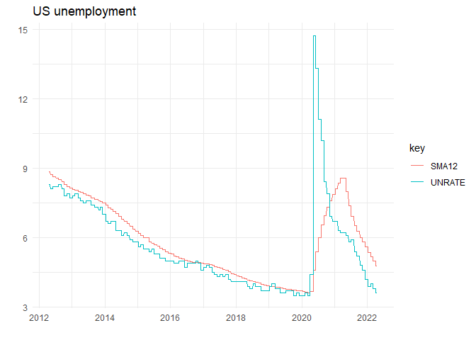
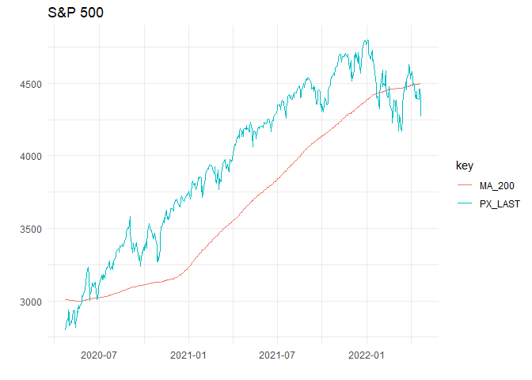
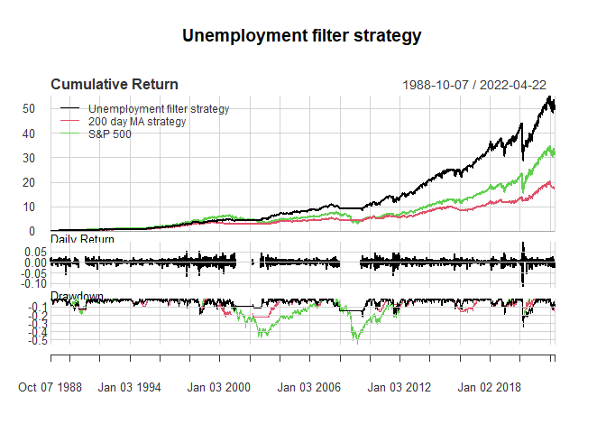
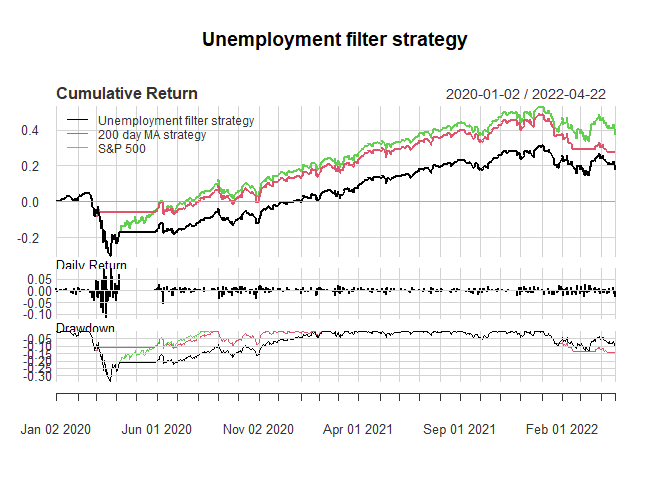

Equity market timing with unemployment
================
David Goebel

-   [Get some data](#get-some-data)
-   [Transform the data and add logic for
    trading](#transform-the-data-and-add-logic-for-trading)
-   [Charts](#charts)
-   [Long term performance](#long-term-performance)
-   [Pandemic performance](#pandemic-performance)

Using trend in unemployment trend as a guide to being invested in equity
markets:

-   Following momentum (here using the 200 DMA as a filter for being in
    the market) helps investors to avoid volatility and reduce
    drawdowns, without giving up much upside over the long term

-   The disadvantages are multi year periods of underperformance as well
    as the discipline required to stick with the strategy

-   Using the trend in US unemployment as an additional filter
    (i.e. only follow equity momentum when recession risk is high)
    markedly increases the performance whilst retaining the attractive
    downside protection

-   This strategy sells the S&P 500 (and holds cash) when the market
    falls below its 200 DMA IF the unemployment is greater than its 1
    year moving average

-   The extraordinary recent spike in unemployment due to the pandemic
    was not as per more usual recessionary behavior and the strategy has
    consequently underperformed recently

## Get some data

``` r
rm(list=ls())

#load some required libraries
library(tidyverse);library(tidyquant);library(Rblpapi);library(PerformanceAnalytics);library(timetk); library(alfred);

start_date <- "1948-01-31" # we have a reasonable period over which we can look at the strategy

# get some data from bloomberg

blpConnect() #connect to bloomberg

tickers <- c("SPX Index")

rawdata <- tickers %>% tq_get(fields = c("PX_LAST", "TOT_RETURN_INDEX_GROSS_DVDS"), # get price and TR data
                              get="rblpapi",
                              from = start_date
                              )

data_wide <- rawdata %>% select(date, PX_LAST, TOT_RETURN_INDEX_GROSS_DVDS)

eq_total_returns=rawdata %>% select(date, TOT_RETURN_INDEX_GROSS_DVDS)
```

## Transform the data and add logic for trading

``` r
lag_periods <- 2

data_wide <- data_wide %>% 
  tq_mutate(select = PX_LAST, # build a 200 day moving average of the price
            mutate_fun = rollapplyr,
            width = 200,
            FUN = mean,
            na.rm = T,
            col_rename = "MA_200") %>% 
  mutate(MA_long = lag(ifelse(PX_LAST>MA_200,1,0), lag_periods)) %>% # be long when above
  mutate(MA_short = lag(ifelse(PX_LAST>MA_200,0,1), lag_periods)) %>% # be short when below
  tq_mutate(TOT_RETURN_INDEX_GROSS_DVDS,
            mutate_fun = periodReturn,
            period = "daily",
            col_rename = "SPX") %>% # calculate returns
              mutate(Strategy200DMA = MA_long*SPX+MA_short*0, # calcuate the returns of the momentum strategy 
                     MA_short_rets = MA_short*SPX+MA_long*0)
            
get <- get_alfred_series("UNRATE") #get the unemployment data from the alfred database

data <- get %>% group_by(realtime_period) %>% slice(n())

data <- data %>% ungroup() %>% tq_mutate(select = UNRATE, # calculate a moving average on the unemployment data
                                         mutate_fun = rollapplyr,
                                         width =12,
                                         FUN = mean,
                                         na.rm = T,
                                         col_rename = "SMA12")

data <- data %>% select(realtime_period, UNRATE, SMA12)

colnames(data)[1] <- "date"

data_wide <- data_wide %>% left_join(data, by= "date") %>% # join the unemployment data with the other data frame
  na.locf() %>% # carry forward last numbers for missing data
  mutate_at(c("UNRATE", "SMA12", "MA_200","SPX"), as.numeric)

data_wide <- data_wide %>% # logic for the unemployment trend
  mutate(MA_short_UE = lag(ifelse(PX_LAST<MA_200 & UNRATE>SMA12,1,0), lag_periods)) %>%
  mutate(MA_long_UE = ifelse(MA_short_UE==0,1,0)) %>% 
  mutate(Strategy_UE=as.numeric(MA_long_UE)*as.numeric(SPX)+as.numeric(MA_short_UE)*as.numeric(0)) %>% # strategy returns
  mutate_at("date", as.Date) %>% 
  mutate_at(c("Strategy200DMA", "SPX"), as.numeric)

#convert to xts
data_wide_xts <- tk_xts(data_wide)

display <- c("Strategy_UE", "Strategy200DMA", "SPX")
```

## Charts

*This strategy would currently suggest being **INVESTED** in equities
because unemployment trend is **DOWN** and equity trend is **DOWN***

``` r
# illustrate with some charts
data_wide %>% select(date, UNRATE, SMA12) %>% 
  filter(date>=ymd(Sys.Date()-years(10))) %>% 
  pivot_longer(c("UNRATE","SMA12"), names_to = "key", values_to = "value") %>%
  ggplot()+
  geom_line(aes(x=date, y=value, colour=key))+
  labs(title = "US unemployment",y="", x="")+
  theme_minimal()
```

<!-- -->

``` r
data_wide %>% select(date, PX_LAST, MA_200) %>% 
  filter(date>=ymd(Sys.Date()-years(2))) %>% 
  pivot_longer(c("PX_LAST","MA_200"), names_to = "key", values_to = "value") %>%
  ggplot()+
  geom_line(aes(x=date, y=value, colour=key))+
  labs(title = "S&P 500",y="", x="")+
  theme_minimal()
```

<!-- -->

## Long term performance

``` r
perf_data <- data_wide_xts["1988-10-07/", display]
colnames(perf_data) <- c("Unemployment filter strategy", "200 day MA strategy", "S&P 500")

perf_table <- rbind(table.AnnualizedReturns(perf_data),
                    table.DownsideRisk(perf_data)[7:9,])
colnames(perf_table) <- c("Unemployment filter strategy", "200 day MA strategy", "S&P 500")
perf_table
```

    ##                           Unemployment filter strategy 200 day MA strategy
    ## Annualized Return                               0.1240              0.0905
    ## Annualized Std Dev                              0.1453              0.1160
    ## Annualized Sharpe (Rf=0%)                       0.8530              0.7798
    ## Maximum Drawdown                                0.3379              0.2208
    ## Historical VaR (95%)                           -0.0140             -0.0117
    ## Historical ES (95%)                            -0.0221             -0.0185
    ##                           S&P 500
    ## Annualized Return          0.1089
    ## Annualized Std Dev         0.1795
    ## Annualized Sharpe (Rf=0%)  0.6064
    ## Maximum Drawdown           0.5522
    ## Historical VaR (95%)      -0.0171
    ## Historical ES (95%)       -0.0269

``` r
charts.PerformanceSummary(perf_data, main = "Unemployment filter strategy")
```

<!-- -->

``` r
#charts.RollingPerformance(perf_data, main = "Unemployment filter strategy", width=242)
```

## Pandemic performance

``` r
charts.PerformanceSummary(perf_data["2020-01-01/"], main = "Unemployment filter strategy")
```

<!-- -->

``` r
table.AnnualizedReturns(perf_data["2020-01-01/"])
```

    ##                           Unemployment filter strategy 200 day MA strategy
    ## Annualized Return                               0.0719              0.1106
    ## Annualized Std Dev                              0.2450              0.1493
    ## Annualized Sharpe (Rf=0%)                       0.2934              0.7412
    ##                           S&P 500
    ## Annualized Return          0.1465
    ## Annualized Std Dev         0.2544
    ## Annualized Sharpe (Rf=0%)  0.5757
